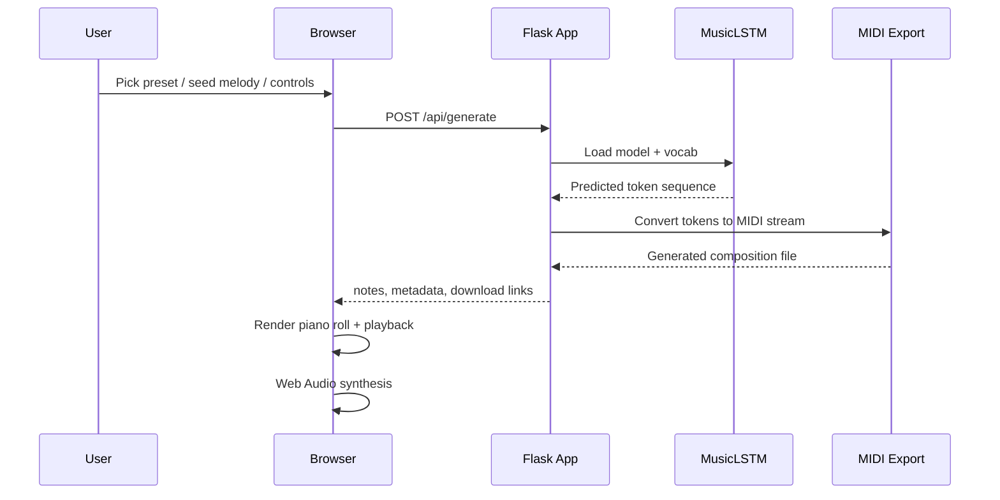

# NeuralHarmony — AI Music Studio

<div align="center">


</div>

NeuralHarmony is a full-stack AI music generation project designed to transform MIDI data into new musical compositions using a PyTorch LSTM model and present them in a modern browser-based studio. The project spans dataset preparation, symbolic music parsing, model training, MIDI generation, and real-time audio synthesis in the browser.

This project was built as a practical demonstration of generative music modeling, combining symbolic sequence learning with an interactive front-end for music creation and playback.

---

## Overview

The system follows a complete generative music pipeline:

1. MIDI data is collected and stored in the `data/raw` directory.
2. MIDI files are parsed into symbolic note/chord tokens using `music21`.
3. Tokenized sequences are transformed into training windows for a sequence model.
4. A custom `MusicLSTM` neural network learns next-token prediction over musical events.
5. The trained model generates new musical token sequences.
6. Those sequences are exported to `.mid` files and rendered through a browser-based Web Audio synth.
7. Users can interact with mood presets, a virtual keyboard, and a playback/visualization panel.

---

## Architecture Pipeline

```mermaid
flowchart LR
    A[Raw MIDI Files\ndata/raw] --> B[MIDI Parsing\n music21 ]
    B --> C[Tokenized Music Events\ndata/processed]
    C --> D[Sequence Dataset\ntraining/data_loader.py]
    D --> E[MusicLSTM Model\ntraining/model.py]
    E --> F[Model Checkpoint\nmodels/best_music_model.pt]
    F --> G[Generation Engine\nscripts/generate_midi.py]
    G --> H[Generated MIDI\ngenerated/*.mid]
    H --> I[Flask API\napp.py]
    I --> J[Interactive Studio\ntemplates + static/js]
    J --> K[Web Audio Playback\nMIDI + WAV Export]
```



### End-to-end execution flow



---

## Project Highlights

### Core AI Music Generation Features
- LSTM-based symbolic music generation with token-level next-step prediction.
- Chord-aware token representation such as `60.64.67` for harmony patterns.
- Temperature-based sampling for controlled creativity.
- Seed-driven composition support from a virtual keyboard.
- MIDI export for generated compositions.

### Interactive Studio Features
- Glassmorphism-inspired UI with modern control panels.
- Genre preset buttons: Classical, Lo-Fi, Cyberpunk, Ambient.
- Virtual piano keyboard using note prompts and keyboard shortcuts.
- Real-time piano roll visualization and playback timeline.
- In-browser Web Audio synthesis with reverb and delay effects.
- Export to both MIDI and generated WAV output.
- Browsing of session track history.

### Technical Features
- Flask REST API with status and generation endpoints.
- Model checkpointing and vocab serialization.
- Automated unit tests for model, pipeline, and web app.
- Modular structure for training, generation, and visualization.

---

## Tech Stack

- Python 3.10+
- PyTorch for model training and inference
- Flask for the web service
- music21 for MIDI parsing and symbolic event extraction
- HTML5, CSS, JavaScript for the studio UI
- Web Audio API for real-time synthesis
- Unittest for automated validation

---

## Repository Structure

```text
task3_music_generation/
├── app.py                          # Flask app and generation API
├── README.md                      # Project documentation
├── requirements.txt               # Dependencies
├── data/
│   ├── raw/                       # Downloaded or sample MIDI files
│   └── processed/                 # Parsed note/chord JSON sequences
├── generated/                     # Output MIDI compositions
├── models/                        # Trained model checkpoint + vocab metadata
├── music/
│   └── parser.py                  # MIDI/music parsing helpers
├── scripts/
│   ├── download_midi.py           # Dataset acquisition utility
│   ├── generate_midi.py           # CLI generation pipeline
│   └── parse_midi.py              # MIDI parsing entry point
├── static/
│   ├── css/
│   └── js/
│       └── app.js                 # Studio logic, playback engine, synth
├── templates/
│   └── index.html                 # Browser UI
├── tests/
│   ├── __init__.py
│   ├── test_app.py                # API and UI smoke tests
│   └── test_pipeline.py           # Model/data pipeline tests
├── training/
│   ├── config.yaml                # Model and training config
│   ├── data_loader.py             # Sequence dataset and vocab creation
│   ├── model.py                   # MusicLSTM model definition
│   └── train_model.py             # Training loop and checkpointing
└── generated/                     # MIDI output files
```

---

## Model Architecture

The generative model is implemented in `training/model.py` and is a lightweight sequence learner based on LSTM layers.

```text
Input token IDs
      ↓
Embedding Layer
      ↓
LSTM Stack
      ↓
Dropout Layer
      ↓
Linear Projection
      ↓
Vocabulary logits
      ↓
Next-token prediction
```

### Why LSTM for music?
- Music is naturally sequential and context-dependent.
- Symbolic tokens have temporal dependencies over notes and chords.
- LSTM handles this sequence learning effectively with modest compute overhead.
- It works well for short-to-medium melodic motifs and harmonic developments.

---

## Data Pipeline

### 1. MIDI collection
The project can obtain sample MIDI files or starter compositions, which are stored in `data/raw`.

### 2. MIDI parsing
Using `music21`, note and chord events are extracted and converted into structured token sequences.

Example parsed event structure:

```json
{
  "pitch": 60,
  "offset": 0.0,
  "duration": 0.5,
  "is_chord": false
}
```

Chord tokens are represented as flattened pitch sequences, for example:

```text
60.64.67
```

### 3. Sequence training windows
The data loader creates sliding windows of previous tokens to predict the next musical event.

---

## Usage

### 1. Install dependencies

```bash
pip install -r requirements.txt
```

### 2. Parse MIDI data

```bash
python scripts/parse_midi.py
```

### 3. Train the model

```bash
python -m training.train_model
```

Optional short training run:

```bash
python -m training.train_model --epochs 5
```

### 4. Generate a MIDI composition from the CLI

```bash
python scripts/generate_midi.py --output generated/my_composition.mid --num_notes 120 --temperature 0.85
```

### 5. Launch the web studio

```bash
python app.py
```

Then open:

```text
http://127.0.0.1:5000
```

---

## API Endpoints

### GET `/api/status`
Returns the model readiness and vocabulary information.

### POST `/api/generate`
Generates a new composition using the trained model and optional seed notes.

Example payload:

```json
{
  "num_notes": 60,
  "temperature": 0.85,
  "seed_notes": ["60", "64", "67"],
  "step_duration": 0.4,
  "instrument": "piano"
}
```

### GET `/api/history`
Returns recent generated MIDI files.

### GET `/download/<filename>`
Downloads a generated MIDI file.

---

## Interaction Model

Users can:
- choose a composition preset,
- adjust temperature and length,
- pick instrument timbre,
- click virtual piano keys to seed a melody,
- generate a track,
- visualize its piano roll,
- play it in-browser,
- export it as MIDI or WAV.

This creates a compact but complete creative workflow from symbolic model output to audible music generation.

---

## Training and Validation

The project includes automated verification for core functionality:

```bash
python -m unittest discover -s tests -p "test_*.py"
```

Verified behaviors include:
- app route health checks,
- generation API responses,
- pipeline conversion logic,
- dataset and vocab creation,
- MIDI export integrity.

---

## Future Improvements

Potential enhancements for the next iteration:
- transformer-based music models,
- larger MIDI datasets and multi-track generation,
- longer context windows and better harmony modeling,
- better audio synthesis with more realistic instrument libraries,
- live waveform visualization and tempo control improvements,
- user-save presets and composition history management.

---

## Conclusion

NeuralHarmony demonstrates how symbolic music generation can combine deep learning, MIDI parsing, and interactive sound design into a single working product. It is a practical, end-to-end project that illustrates the journey from raw music data to generated compositions and browser-based playback.

The result is a complete generative music project that blends machine learning, creative tooling, and user interaction in one experience.

---

## License

This project is intended for educational and research-oriented use. Add an appropriate license if you plan to distribute or share it publicly.

---

## Author / Project Context

This project was developed as part of the CodeAlpha AI Internship music generation task, with emphasis on building an end-to-end generative music application using deep learning and interactive front-end audio synthesis.

