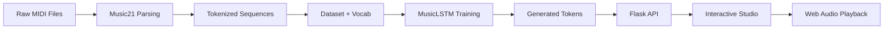

# NeuralHarmony — AI Music Studio

<p align="center">
  
</p>

<p align="center">
  
  
  
  
  
</p>

NeuralHarmony is an end-to-end AI music generation project that converts MIDI data into new symbolic compositions using a PyTorch LSTM model and presents the output in a modern interactive browser-based music studio.

## Highlights

- Symbolic music generation with LSTM-based sequence learning
- MIDI parsing and processing using `music21`
- Composition generation with temperature-based creativity control
- Browser UI with virtual piano seed prompts
- Real-time piano-roll visualization
- Web Audio synthesis with reverb and delay effects
- MIDI and WAV export
- Automated tests for pipeline and API validation

## Architecture



## Quick Start

```bash
pip install -r requirements.txt
python scripts/parse_midi.py
python -m training.train_model
python app.py
```

Open: http://127.0.0.1:5000

## Project Structure

```text
.
├── app.py
├── README.md
├── requirements.txt
├── data/
├── generated/
├── models/
├── music/
├── scripts/
├── static/
├── templates/
├── tests/
├── training/
└── assets/
```

## Tech Stack

- Python
- PyTorch
- Flask
- music21
- HTML / CSS / JavaScript
- Web Audio API

## Status

Project is working end-to-end with model generation, web studio playback, and export flow validated.
